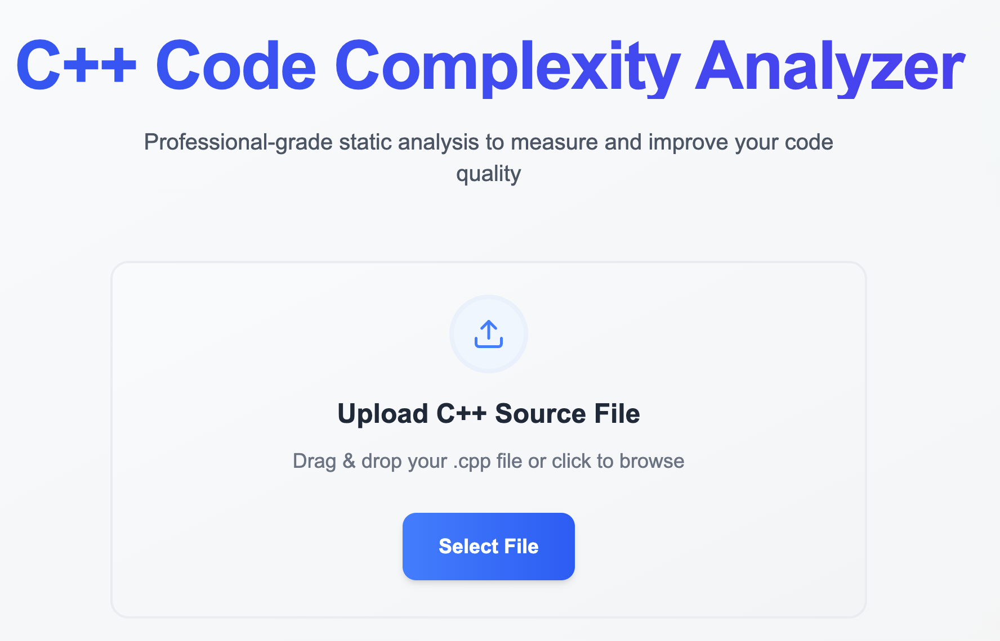
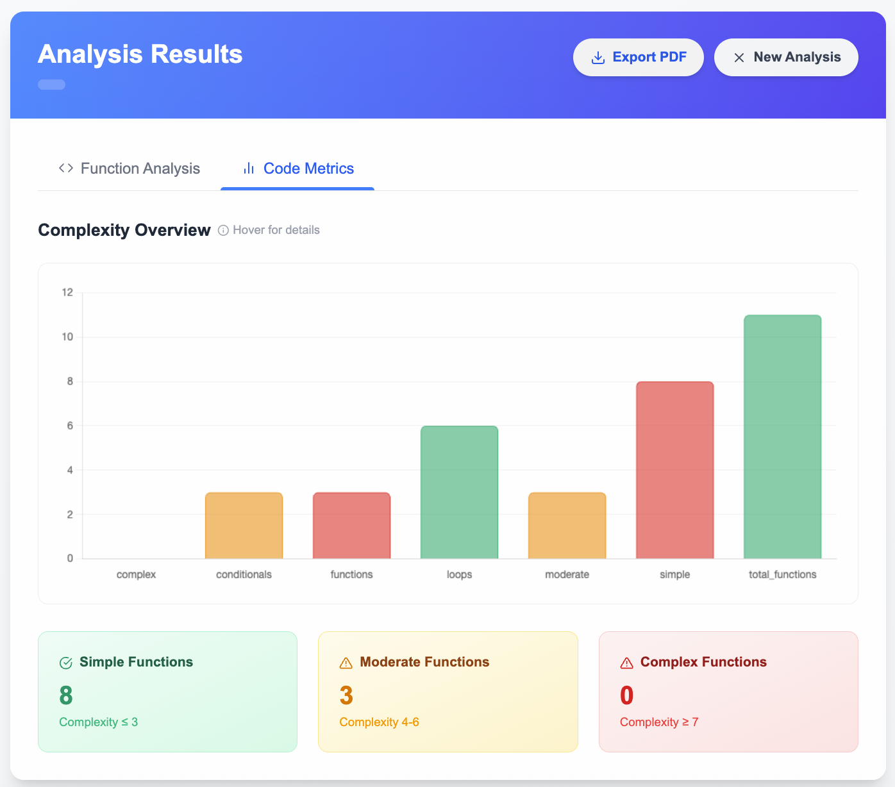

# 🔍 C++ Code Complexity Analyzer

<div align="center">

[](https://typescriptlang.org/)
[](https://djangoproject.com/)
[](https://nextjs.org/)
[](https://isocpp.org/)

**Professional-grade static analysis tool for measuring and improving C++ code quality**

[Features](#-features) • [Installation](#-installation) • [Usage](#-usage) • [API](#-api-reference) • [Contributing](#-contributing)

</div>

---

## 📸 Screenshots

<div align="center">

### 🏠 Modern Interface


### 📊 Comprehensive Analytics


</div>

---

## 🚀 Features

### 🔬 **Advanced Code Analysis**
- **Cyclomatic Complexity Measurement** - Quantifies code complexity using industry-standard metrics
- **Function-Level Analysis** - Deep dive into individual function complexity and performance characteristics
- **Nesting Depth Detection** - Identifies deeply nested code structures that impact maintainability
- **Loop & Conditional Counting** - Comprehensive control flow analysis

### ⚡ **Performance Intelligence**
- **Time Complexity Estimation** - Algorithmic complexity analysis (O(1), O(n), O(n²), O(2ⁿ))
- **Space Complexity Analysis** - Memory usage pattern detection
- **Recursion Detection** - Identifies recursive functions and potential stack overflow risks
- **Array Usage Tracking** - Memory allocation pattern analysis

### 🎨 **Premium User Experience**
- **Drag & Drop Upload** - Intuitive file handling with visual feedback
- **Real-time Processing** - Instant analysis with progress indicators
- **Interactive Visualizations** - Beautiful charts powered by Chart.js
- **Responsive Design** - Seamless experience across all devices
- **Dark Mode Support** - Eye-friendly interface options

### 📄 **Professional Reporting**
- **PDF Export** - Generate comprehensive analysis reports
- **Detailed Metrics** - Function-by-function breakdown
- **Actionable Insights** - Specific recommendations for code improvement
- **Complexity Categorization** - Simple/Moderate/Complex classification system

---

## 🛠 Tech Stack

### **Frontend**
- **Framework**: Next.js 15 with TypeScript
- **Styling**: Tailwind CSS with custom gradients and animations
- **Charts**: Chart.js with React integration
- **Icons**: React Icons (Feather Icons)
- **Animations**: Framer Motion for smooth transitions
- **HTTP Client**: Axios for API communication

### **Backend**
- **Framework**: Django REST Framework
- **Language**: Python 3.x
- **File Processing**: Multi-part form handling
- **PDF Generation**: ReportLab for professional reports
- **CORS**: Cross-origin resource sharing enabled

### **Analysis Engine**
- **Language**: C++ with modern STL
- **Parsing**: Advanced regex patterns for code analysis
- **JSON Output**: nlohmann/json library for structured data
- **Build System**: CMake compatible

---

## 📦 Installation

### Prerequisites
- **Node.js** 18+ and npm/yarn
- **Python** 3.8+ with pip
- **C++ Compiler** (GCC 9+ or Clang 10+)
- **CMake** 3.16+ (optional, for building analyzer)

### 🔧 Quick Setup

```bash
# Clone the repository
git clone https://github.com/yourusername/code-complexity-analyzer.git
cd code-complexity-analyzer

# Setup Frontend
cd frontend
npm install
npm run dev

# Setup Backend (in new terminal)
cd ../backend
pip install -r requirements.txt
python manage.py runserver

# Build C++ Analyzer
cd ../cpp_analyzer
mkdir build && cd build
cmake ..
make
```

### 🐳 Docker Setup (Recommended)

```bash
# Coming soon - Docker Compose setup for one-command deployment
docker-compose up --build
```

---

## 🎯 Usage

### **Web Interface**

1. **Upload Your Code**
   - Drag and drop your `.cpp` files into the upload area
   - Or click to browse and select files manually

2. **Analyze & Review**
   - Click "Analyze Code" to start the processing
   - Review detailed metrics and visualizations
   - Examine function-level complexity scores

3. **Export Results**
   - Generate professional PDF reports
   - Share insights with your team
   - Track improvements over time

### **Command Line Interface**

```bash
# Direct analysis
./cpp_analyzer/build/analyzer your_code.cpp

# Output example
{
  "summary": {
    "functions": 5,
    "loops": 12,
    "conditionals": 8,
    "simple": 3,
    "moderate": 1,
    "complex": 1
  },
  "functions_detail": [
    {
      "name": "quickSort",
      "complexity": 4,
      "time_complexity": "O(n log n)",
      "space_complexity": "O(log n)",
      "issues": ["Deep nesting detected (level 4)"]
    }
  ]
}
```

---

## 📊 Complexity Metrics

### **Scoring System**

| Score Range | Category | Color | Description |
|-------------|----------|-------|-------------|
| 1-3 | **Simple** | 🟢 Green | Low complexity, easy to maintain |
| 4-6 | **Moderate** | 🟡 Amber | Moderate complexity, may need refactoring |
| 7+ | **Complex** | 🔴 Red | High complexity, requires immediate attention |

### **Analysis Factors**
- **Control Flow**: if/else statements, loops, switch cases
- **Nesting Depth**: Maximum indentation levels
- **Function Length**: Lines of code per function  
- **Recursion**: Self-referential function calls
- **Data Structures**: Array and container usage patterns

---

## 🌐 API Reference

### **Analyze Code**
```http
POST /api/analyze/
Content-Type: multipart/form-data

{
  "file": <cpp_file>
}
```

**Response:**
```json
{
  "summary": {
    "functions": 10,
    "loops": 15,
    "conditionals": 20,
    "simple": 7,
    "moderate": 2,
    "complex": 1
  },
  "functions_detail": [...],
  "file_name": "example.cpp"
}
```

### **Generate PDF Report**
```http
POST /api/download-pdf/
Content-Type: application/json

{
  "file_name": "analysis_results",
  "summary": {...},
  "functions_detail": [...]
}
```

---

## 🔮 Future Roadmap

- [ ] **Multi-language Support** - Java, Python, JavaScript analysis
- [ ] **CI/CD Integration** - GitHub Actions, Jenkins plugins  
- [ ] **Team Dashboards** - Multi-project tracking and trends
- [ ] **Custom Rules Engine** - Define your own complexity rules
- [ ] **Machine Learning Insights** - AI-powered code suggestions
- [ ] **Real-time Collaboration** - Share and discuss analysis results
- [ ] **Integration APIs** - IDE plugins for VS Code, CLion

---

## 🤝 Contributing

We welcome contributions from the community! Here's how you can help:

### **Development Setup**
```bash
# Fork the repository
git clone https://github.com/your-fork/code-complexity-analyzer.git

# Create feature branch
git checkout -b feature/amazing-new-feature

# Make your changes and commit
git commit -m "Add amazing new feature"

# Push and create pull request
git push origin feature/amazing-new-feature
```

### **Contribution Guidelines**
- 📋 **Issues**: Report bugs or request features via GitHub Issues
- 🔧 **Pull Requests**: Follow our PR template and coding standards
- 📖 **Documentation**: Help improve our docs and examples
- 🧪 **Testing**: Add tests for new features and bug fixes

---

## 📄 License

This project is licensed under the **MIT License** - see the [LICENSE](LICENSE) file for details.

---

## 🎖 Acknowledgments

- **Chart.js** team for excellent visualization library
- **Django REST Framework** for robust API foundation  
- **Next.js** team for the amazing React framework
- **nlohmann/json** for elegant C++ JSON handling
- **Open Source Community** for inspiration and support

---

## 📞 Support & Contact

- **🐛 Bug Reports**: [GitHub Issues](https://github.com/bitgladiator/code-complexity-analyzer/issues)
- **💡 Feature Requests**: [Discussions](https://github.com/bitgladiator/code-complexity-analyzer/discussions)  
- **📧 Email**: karansh1232@gmail.com
- **🐦 Twitter**: [KaranSharma1020](https://twitter.com/KaranSharma1020)

---

<div align="center">

**⭐ If this project helped you, please give it a star! ⭐**

Made with ❤️ by [Your Name](https://github.com/bitgladiator)

*Empowering developers to write better, more maintainable C++ code*

</div>